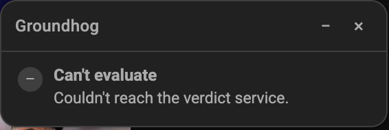

# Groundhog

Groundhog checks a YouTube video against everything you've already watched
before you spend time on it. That way you can tell whether it's actually
saying something new, or just another take on something you've already
seen.

Open a video. Within a few seconds, a small overlay tells you:

- **How novel** it is compared to your watch history
- **How well-executed** it is
- **How deep** it goes
- A plain-language recommendation, with a specific explanation (it names
  the actual video it's comparing against, not a vague "your history")

It never skips or hides anything. You always decide what to watch.
Groundhog is two pieces: a browser extension that watches what you open,
and a small local server (the companion) that does the actual thinking.
It only covers regular `youtube.com/watch` pages, not Shorts or embedded
players.


A closer look at a real verdict: scores plus a specific, grounded
explanation that names the exact video it's comparing against, not just a
generic "your watch history":


When it can't form an opinion (no transcript, the companion isn't running,
or the model call failed), it shows the same neutral "can't evaluate" badge
instead of guessing or failing silently:



## Architecture at a glance

```
┌───────────────────────┐        localhost:8787         ┌───────────────────────────┐
│  Chrome extension      │  ── fetch() + secret header ─▶│  Python companion (bg)    │
│  - content script      │    video ID, watch events     │  - FastAPI/uvicorn server │
│  - on-page overlay UI  │ ◀──── JSON verdict ─────────  │  - yt-dlp (transcripts)   │
│  - options page        │                                │  - sentence-transformers │
└───────────────────────┘                                │    + sqlite-vec (corpus) │
                                                            │  - Gemini (verdict call)  │
                                                            └───────────────────────────┘
```

A browser extension can't write files, run Python, or keep a background
process alive, so the actual work happens in a local companion process:

- **Chrome extension**: a content script detects the video ID and tracks
  watch progress on the page; a background service worker talks to the
  companion over HTTP; an options page holds the user-facing settings (see
  "Configuration" below).
- **Python companion**: a FastAPI server that fetches the transcript via
  `yt-dlp`, embeds it locally with `sentence-transformers`, searches a
  `sqlite-vec` corpus of your watch history for the closest topical matches,
  and sends the new video's full transcript plus the matches' full
  transcripts to Gemini for a structured verdict (novelty, execution, depth,
  explanation, recommendation).

The two talk over authenticated `http://127.0.0.1:8787`, gated by a shared
secret so a random tab in your browser can't poke the companion.

For the full design rationale (why HTTP instead of native messaging, why
Gemini instead of Claude, why full transcripts instead of excerpts, why a
70%/5-minute watch threshold, etc.), see [`PLAN.md`](PLAN.md) and
[`DECISIONS.md`](DECISIONS.md).

## Prerequisites

- **macOS**: the companion auto-starts via a `launchd` LaunchAgent, which is
  macOS-specific.
- **[`uv`](https://docs.astral.sh/uv/getting-started/installation/)** (e.g.
  `brew install uv`): `install.sh` uses it to provision Python 3.12 itself,
  so you don't need any particular Python already installed.
- **Chrome**
- A free **Gemini API key** from [aistudio.google.com](https://aistudio.google.com)

## Setup

1. **Clone the repo and run the installer:**

   ```
   git clone <this-repo>
   cd groundhog
   ./install.sh
   ```

   This creates a `.venv`, installs dependencies from `requirements.txt`,
   generates a one-time shared secret at `.groundhog-secret`, and registers +
   starts a `launchd` service that runs the companion at
   `http://127.0.0.1:8787`. It's safe to re-run and won't overwrite an
   existing secret. If `GEMINI_API_KEY` isn't already set in your shell or in
   a `.env` file at the repo root, it'll prompt you for one and save it to
   `.env` (gitignored) for future runs. Check it came up with:

   ```
   curl http://127.0.0.1:8787/health
   ```

2. **Load the extension into Chrome:**
   - Go to `chrome://extensions`
   - Turn on "Developer mode" (top right)
   - Click "Load unpacked" and select the repo's `extension/` folder

3. **Paste the shared secret into the options page:**
   - Right-click the Groundhog extension icon → "Options" (or find it under
     "Manage extension" → "Extension options")
   - Copy the contents of `.groundhog-secret` from the repo root into the
     "Shared secret" field and click Save

4. **(Optional) Set or change your Gemini API key.** Get a free key from
   [aistudio.google.com](https://aistudio.google.com). If step 1 already
   prompted you for one, you're done. To set or change it without being
   prompted, edit `.env` at the repo root and re-run `install.sh`:

   ```
   GEMINI_API_KEY=your-key-here
   ```

   `install.sh` reads this and wires it into the launchd service directly,
   so you don't need to run any manual `launchctl` steps.

5. **(Optional) Seed the corpus from your existing watch history.** Export
   `watch-history.json` from [Google Takeout](https://takeout.google.com)
   (YouTube and YouTube Music → history), then run a small smoke test first:

   ```
   python backfill.py path/to/watch-history.json --limit 20
   ```

   Once that looks right, run it again without `--limit` to process your
   full history:

   ```
   python backfill.py path/to/watch-history.json
   ```

   This is sequential and rate-limited on purpose (see the "Backfill" section
   of [`DECISIONS.md`](DECISIONS.md)). A history of a few thousand videos can
   take several hours. It's resumable: re-running after an
   interruption picks up where it left off instead of starting over. You can
   also add one video at a time with `python add_video.py <url-or-video-id>`.

## Day-to-day usage

Open any `youtube.com/watch` page. The overlay appears in the bottom-right
corner showing "Checking your watch history…" immediately, then fills in
with scores and a recommendation within a few seconds (transcript retrieval
alone typically takes 2-4 seconds, so the whole pipeline usually lands in
well under 10 seconds). You can collapse it to a small pill or dismiss it
entirely from its header buttons.

Once you watch a video past 70% or 5 minutes, whichever comes first,
Groundhog fetches it, embeds it, and adds it to the corpus automatically.
You don't need to do anything else after the initial backfill.

## Configuration

The extension's options page (`chrome://extensions` → Groundhog → Options)
has:

- **Shared secret**: pasted from `.groundhog-secret`, required for the
  extension to authenticate to the companion.
- **K (videos compared per check)**: a 1–10 slider for how many of your
  closest-matching watched videos (by vector search) get sent to Gemini
  alongside the new video for comparison. Higher K is a more thorough (and
  more expensive/slower) check; lower is cheaper and faster. Defaults to 5.
- **Model**: which Gemini model checks each video: Flash (default), Flash
  Lite (cheapest/fastest), or Pro (slower, more thorough).
- **Debug log**: a collapsed section showing recent background-worker
  activity (request/response/delivery steps). It's persisted so it's
  readable even when the browser's own console for the extension isn't.
  Useful if a video ever gets stuck on "Checking..." or "Marking as
  watched...".

## Running tests

Companion (Python, `unittest`):

```
.venv/bin/python -m unittest discover -s . -p "test_*.py"
```

Extension (Node's built-in `node:test`, no framework dependency):

```
cd extension && npm test
```

## Project status

This is a personal, experimental project, not production software. It works
end to end (transcript fetch → embed → vector search → Gemini verdict →
overlay), but a few things are worth knowing:

- **Transcript fetching is inherently a bit fragile.** It relies on `yt-dlp`'s
  `android_vr` client being exempt from YouTube's PO-token requirement, which
  could change at any time. See [`DECISIONS.md`](DECISIONS.md) for the
  fallback plan if that happens.
- **No spend cap.** There's no tracked ceiling on Gemini API usage yet.

See the "Deferred, not forgotten" and "Not part of this tool" sections of
[`PLAN.md`](PLAN.md) for the fuller list of what's intentionally out of scope
for now (Shorts support and similar).

## License

MIT. See [`LICENSE`](LICENSE).
