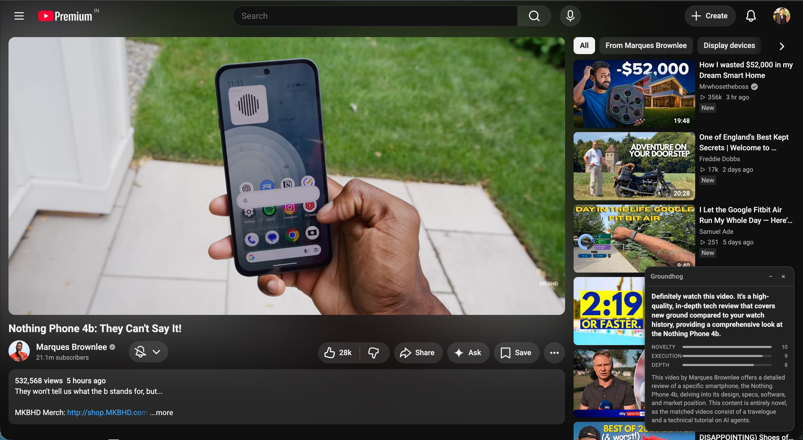
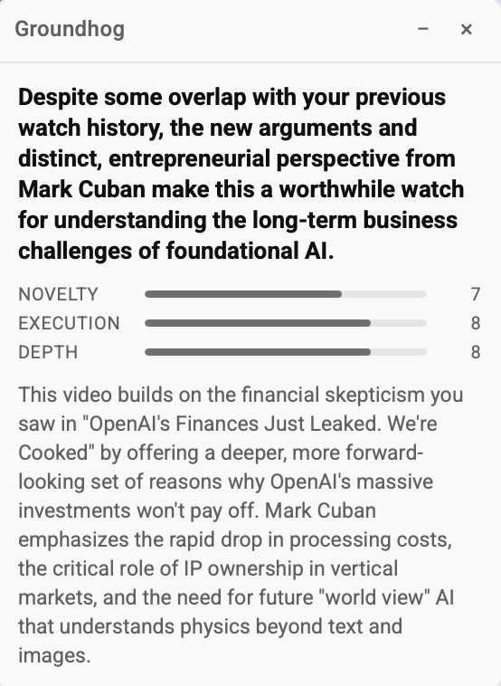
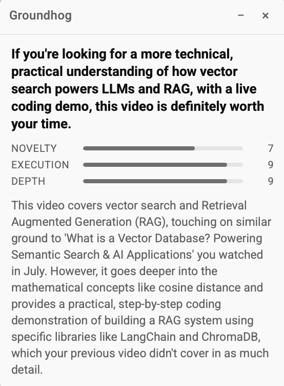
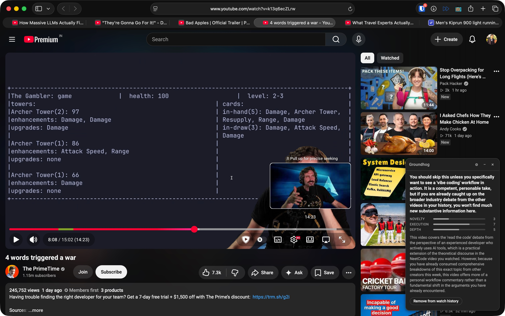
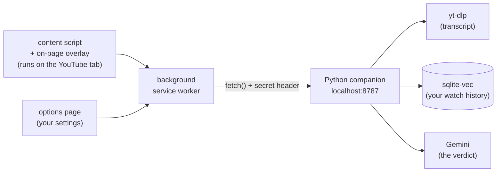

# Groundhog

> [!NOTE]
> Full disclosure: I'm glued to YouTube. It's by far my most-used website (can you blame me? there are SO many talented creators and interesting stories). But I'm trying to be more intentional about the content I consume. I don't want to burn an hour on a video that's just a rehash of something I've already watched. So I built Groundhog to be my personal video-vetting assistant.
>
> (Yes, the name is a Groundhog Day reference. Bill Murray gets stuck reliving the same day forever, which is basically what my watch history looked like before I built this.)

Groundhog checks a YouTube video against everything you've already watched
before you spend time on it. That way you can tell whether it's actually
saying something new, or just another take on something you've already
seen.

https://github.com/user-attachments/assets/e9979aad-0d66-4792-a938-f61fc89d095d

When you open a youtube video, within a few seconds, a small overlay tells you:

- **How novel** it is compared to your watch history
- **How well-executed** it is
- **How deep** it goes
- A plain-language recommendation, with a specific explanation (it even names
  the previous videos it's comparing against)

It never skips or hides anything. You always decide what to watch.
Groundhog is two pieces: a browser extension that watches what you open,
and a small local server (the companion) that does the actual thinking.
It only covers regular `youtube.com/watch` pages, not Shorts or embedded
players.

## Examples

A few real verdicts, showing the range: strong recommends, mixed calls,
and skips, each with detailed explanations:

<details>
<summary>Groundhog overlay recommending a high-novelty tech review, scoring it 10/9/8</summary>



</details>

<details>
<summary>Groundhog overlay giving a moderate 7/8/8 verdict on a video with some overlap with prior watch history</summary>



</details>

<details>
<summary>Groundhog overlay scoring a technical deep dive 7/9/9 for going further than a similar video already watched</summary>



</details>

<details>
<summary>Groundhog overlay recommending a skip, scoring a video 3/7/5 for covering ground already seen that week</summary>



</details>

## Architecture at a glance

A browser extension can't write files, run Python, or keep a background
process alive, so the actual work happens in a local companion process:



- **Browser extension** (Chrome or Safari): a content script detects the
  video ID and tracks watch progress on the page; a background service
  worker talks to the companion over HTTP; an options page holds your
  settings (see "Configuration" below).
- **Python companion**: a FastAPI server that fetches the transcript via
  `yt-dlp`, embeds it locally with `sentence-transformers`, searches a
  `sqlite-vec` corpus of your watch history for the closest topical matches,
  and sends the new video's full transcript plus the matches' full
  transcripts to Gemini for a structured verdict (novelty, execution, depth,
  explanation, recommendation).

The two talk over authenticated `http://127.0.0.1:8787`, gated by a shared
secret so a random tab in your browser can't interfere with the companion.

**What happens when you open a video:**

1. The extension notices the new video and asks the companion whether it's
   already in your watch history.
2. If it is, you just get a quiet "already watched" message. There are no API calls
   spent re-judging something you've already seen.
3. If it isn't, the companion fetches the transcript, embeds it, and finds
   the closest topical matches from everything you've already watched.
4. It sends the new transcript plus those matches to Gemini, and the
   overlay shows the verdict a few seconds later.

For my full design rationale (why HTTP instead of native messaging, why
Gemini instead of Claude, why full transcripts instead of excerpts, why a
70%/5-minute watch threshold, etc.) see [`DECISIONS.md`](DECISIONS.md).

## Prerequisites

- **[`uv`](https://docs.astral.sh/uv/getting-started/installation/)** (e.g.
  `brew install uv`): `install.sh` uses it to provision Python 3.12 itself,
  so you don't need any particular Python already installed.
- **Chrome or Safari** - same `extension/` folder works unpacked in either,
  no separate Safari build or Xcode step needed.
- A free **Gemini API key** from [aistudio.google.com](https://aistudio.google.com)

## Setup

> [!TIP]
> This is how I'm running Groundhog myself right now: run
> `install.sh` to start the Python server and then load the extension to Safari. I've also backfilled my Google Takeout Youtube watch history via a script. Both are one-time tasks. [Issue #45](https://github.com/naveenk2k/groundhog/issues/45)
> tracks shipping the whole thing as a single install instead.

1. **Clone the repo and run the installer:**

   ```
   git clone <this-repo>
   cd groundhog
   ./install.sh
   ```

   This creates a `.venv`, installs dependencies from `requirements.txt`,
   generates a one-time shared secret at `.groundhog-secret`, and registers +
   starts a `launchd` service that runs the companion at
   `http://127.0.0.1:8787`. It's safe to re-run and won't overwrite an
   existing secret. If `GEMINI_API_KEY` isn't already set in your shell or in
   a `.env` file at the repo root, it'll prompt you for one and save it to
   `.env` (gitignored) for future runs. Check it came up with:

   ```
   curl http://127.0.0.1:8787/health
   ```

2. **Load the extension into your browser** (Chrome and Safari both work
   identically from here on - everything past this step applies to either):
   - **Chrome**: go to `chrome://extensions`, turn on "Developer mode" (top
     right), click "Load unpacked," and select the repo's `extension/`
     folder.
   - **Safari**: load `extension/` as a temporary extension under Safari's
     own Extensions settings. Safari's reload button there doesn't tear
     down tabs opened before the reload - open a fresh tab if you've just
     reloaded after a code change (tracked as issue #40).

3. **Paste the shared secret into the options page.** Click the Groundhog
   toolbar icon to open it directly (it falls back to opening options
   whenever there's no dismissed overlay to bring back instead - see
   "Configuration" below). If you don't see the icon, right-click it and
   choose "Options" in Chrome (or find it under "Manage extension" →
   "Extension options"), or find Groundhog under Safari's own Extensions
   settings. Either way, copy the contents of `.groundhog-secret` from the
   repo root into the "Shared secret" field and click Save.

4. **(Optional) Set or change your Gemini API key.** Get a free key from
   [aistudio.google.com](https://aistudio.google.com). If step 1 already
   prompted you for one, you're done. To set or change it without being
   prompted, edit `.env` at the repo root and re-run `install.sh`:

   ```
   GEMINI_API_KEY=your-key-here
   ```

   `install.sh` reads this and wires it into the launchd service directly,
   so you don't need to run any manual `launchctl` steps.

5. **(Optional) Seed the corpus from your existing watch history.** Export
   `watch-history.json` from [Google Takeout](https://takeout.google.com)
   (YouTube and YouTube Music → history), then run a small smoke test first:

   ```
   python backfill.py path/to/watch-history.json --limit 20
   ```

   Once that looks right, run it again without `--limit` to process your
   full history:

   ```
   python backfill.py path/to/watch-history.json
   ```

   This is sequential and rate-limited on purpose (see the "Backfill" section
   of [`DECISIONS.md`](DECISIONS.md)). A history of a few thousand videos can
   take several hours. It's resumable: re-running after an
   interruption picks up where it left off instead of starting over. You can
   also add one video at a time with `python add_video.py <url-or-video-id>`.

> [!TIP]
> This is how I'm running Groundhog myself right now: clone the repo, run
> `install.sh` to start the Python server and then load the extension to Safari. I've also backfilled my Google Takeout Youtube watch history via a script. [Issue #45](https://github.com/naveenk2k/groundhog/issues/45)
> tracks shipping this as a single install instead.

## Day-to-day usage

- The overlay runs automatically on any `youtube.com/watch` page, and can be
  collapsed to a pill or dismissed.
- **Cmd+G** and **Cmd+Shift+G** (Ctrl on Windows/Linux) are set up as default
  shortcuts for the overlay and options page.
- A video gets added to your watch history automatically once you watch
  past 70% or 5 minutes, whichever comes first.

## Configuration

The extension's options page - reachable by clicking the Groundhog toolbar
icon (or `chrome://extensions` → Groundhog → Options) - has:

- **Shared secret**: pasted from `.groundhog-secret`, required for the
  extension to authenticate to the companion.
- **K (videos compared per check)**: a 1-10 slider for how many of your
  closest-matching watched videos (by vector search) get sent to Gemini
  alongside the new video for comparison. Higher K is a more thorough (and
  more expensive/slower) check; lower is cheaper and faster. Defaults to 5.
- **Model**: which Gemini model checks each video: Flash (default), Flash
  Lite (cheapest/fastest), or Pro (slower, more thorough).
- **Debug log**: a collapsed section showing recent background-worker
  activity (request/response/delivery steps). It's persisted so it's
  readable even when the browser's own console for the extension isn't.
  Useful if a video ever gets stuck on "Checking..." or "Marking as
  watched...".

## Running tests

Companion (Python, `unittest`):

```
.venv/bin/python -m unittest discover -s . -p "test_*.py"
```

Extension (Node's built-in `node:test`, no framework dependency):

```
cd extension && npm test
```

## Project status

This is largely a personal, experimental project to help me consume new and better content. It works
end to end (transcript fetch → embed → vector search → Gemini verdict →
overlay), but a few things are worth knowing:

- **Transcript fetching is inherently a bit fragile.** It relies on `yt-dlp`'s
  `android_vr` client being exempt from YouTube's PO-token requirement, which
  could change at any time. See [`DECISIONS.md`](DECISIONS.md) for the
  fallback plan if that happens.
- **No spend cap.** There's no tracked ceiling on Gemini API usage yet, just a simple email notification.

Shorts, embedded players on other sites, and any kind of auto-pause or
auto-skip are intentionally out of scope. For any improvements in the works, see the [open issues](../../issues).

## License

MIT. See [`LICENSE`](LICENSE).
